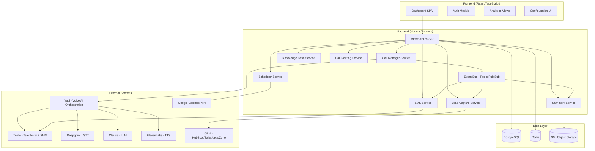
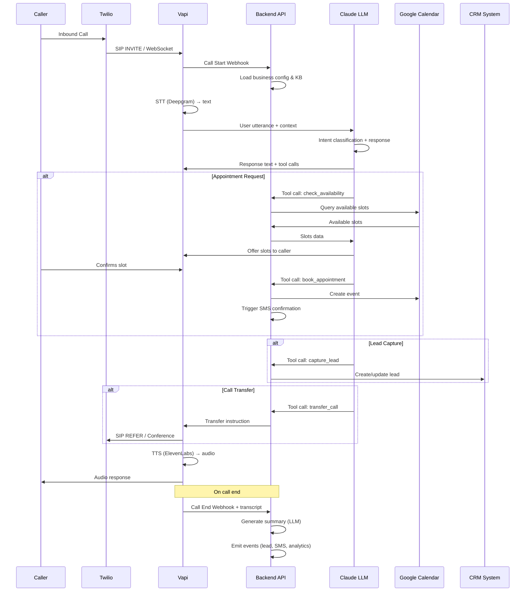
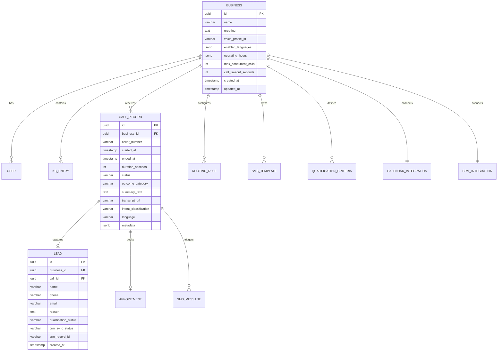

# Design Document: AI Receptionist

## Overview

The AI Receptionist is a full-stack platform that enables businesses to deploy an AI-powered phone receptionist. The system answers inbound calls 24/7, handles appointment booking, answers FAQs from a configurable knowledge base, routes calls to humans when needed, captures leads with CRM sync, sends SMS follow-ups, generates call summaries/transcripts, and supports multiple languages.

The architecture follows a microservices-inspired approach with a React/TypeScript frontend dashboard, a Node.js/Express API server, and integrations with third-party services for telephony, speech processing, and AI orchestration.

### Key Design Decisions

1. **Voice AI Orchestration via Vapi** — Vapi handles real-time audio streaming, STT/TTS coordination, and turn-taking. This reduces custom WebSocket management and provides sub-1.5s response latency out of the box.
2. **Twilio for Telephony** — Industry standard for phone number provisioning, inbound SIP trunking, and SMS. Broad documentation and reliability at scale.
3. **Deepgram Nova-3 for STT** — Fastest real-time transcription with best accuracy for multi-language support.
4. **Claude (Anthropic) as primary LLM** — Strong conversational quality, tool-use capabilities for structured actions (booking, routing), and reliable intent classification.
5. **ElevenLabs for TTS** — Most natural-sounding voice synthesis with multiple voice profiles and multi-language support.
6. **Event-driven backend** — Call lifecycle events flow through an event bus (Redis pub/sub) enabling decoupled processing of transcripts, summaries, CRM sync, and SMS delivery.

## Architecture



### Request Flow: Inbound Call



## Components and Interfaces

### Frontend Components

| Component | Responsibility |
|-----------|---------------|
| `AuthProvider` | JWT-based authentication, session management, inactivity timeout (30 min) |
| `DashboardLayout` | Responsive shell (≥768px), navigation, WCAG 2.1 AA compliance |
| `CallMonitor` | Real-time call status display (active/queued/completed), WebSocket updates |
| `KnowledgeBaseEditor` | CRUD for KB entries with category management and validation |
| `RoutingRuleEditor` | Configure routing rules by intent category with priority destinations |
| `LeadsList` | Paginated lead display (20/page) with qualification status filters |
| `AnalyticsDashboard` | Charts for call volume, conversion rates, routing frequency |
| `ConfigPanel` | Business name, greeting, voice selection, operating parameters |
| `SMSTemplateEditor` | Follow-up and reminder template configuration |
| `CallHistory` | Searchable/filterable call logs with summaries and transcripts |
| `LanguageSettings` | Enable/disable languages, per-language KB content management |

### Backend API Endpoints

| Endpoint | Method | Description |
|----------|--------|-------------|
| `/api/auth/login` | POST | Email/password authentication, returns JWT |
| `/api/auth/refresh` | POST | Refresh expired token |
| `/api/calls` | GET | List call history with filters/search |
| `/api/calls/:id` | GET | Call detail with summary and transcript |
| `/api/calls/active` | GET | Current active/queued calls (WebSocket upgrade available) |
| `/api/knowledge-base` | GET/POST | List and create KB entries |
| `/api/knowledge-base/:id` | PUT/DELETE | Update and delete KB entries |
| `/api/routing-rules` | GET/POST/PUT/DELETE | CRUD for routing configuration |
| `/api/leads` | GET | Paginated lead list |
| `/api/leads/:id` | GET/PUT | Lead detail and status updates |
| `/api/config` | GET/PUT | Business configuration (greeting, voice, hours) |
| `/api/sms/templates` | GET/POST/PUT/DELETE | SMS template management |
| `/api/sms/history` | GET | SMS delivery status history |
| `/api/analytics` | GET | Aggregated analytics data |
| `/api/integrations/calendar` | POST/DELETE | Connect/disconnect calendar |
| `/api/integrations/crm` | POST/DELETE | Connect/disconnect CRM |
| `/api/webhooks/vapi/call-start` | POST | Vapi call start event |
| `/api/webhooks/vapi/call-end` | POST | Vapi call end event with transcript |
| `/api/webhooks/vapi/tool-call` | POST | Vapi tool call handler (booking, routing, lead capture) |

### Service Interfaces

```typescript
// Call Manager Service
interface ICallManager {
  handleCallStart(event: VapiCallStartEvent): Promise<CallSession>;
  handleCallEnd(event: VapiCallEndEvent): Promise<void>;
  handleToolCall(event: VapiToolCallEvent): Promise<ToolCallResult>;
  getActiveCalls(businessId: string): Promise<ActiveCall[]>;
  getCallHistory(businessId: string, filters: CallFilters): Promise<PaginatedResult<CallRecord>>;
}

// Knowledge Base Service
interface IKnowledgeBaseService {
  getEntries(businessId: string, category?: string): Promise<KBEntry[]>;
  createEntry(businessId: string, entry: CreateKBEntryDTO): Promise<KBEntry>;
  updateEntry(entryId: string, updates: UpdateKBEntryDTO): Promise<KBEntry>;
  deleteEntry(entryId: string): Promise<void>;
  search(businessId: string, query: string, language?: string): Promise<KBEntry[]>;
}

// Lead Capture Service
interface ILeadCaptureService {
  captureLead(businessId: string, leadData: LeadCaptureDTO): Promise<Lead>;
  qualifyLead(lead: Lead, criteria: QualificationCriteria[]): QualificationStatus;
  syncToCRM(lead: Lead, crmConfig: CRMConfig): Promise<SyncResult>;
  getLeads(businessId: string, filters: LeadFilters): Promise<PaginatedResult<Lead>>;
}

// SMS Service
interface ISMSService {
  sendConfirmation(appointment: Appointment, phoneNumber: string): Promise<SMSResult>;
  sendReminder(appointment: Appointment, interval: ReminderInterval): Promise<SMSResult>;
  sendFollowUp(callOutcome: CallOutcome, template: SMSTemplate, phoneNumber: string): Promise<SMSResult>;
  getDeliveryStatus(messageId: string): Promise<SMSDeliveryStatus>;
  retryFailed(messageId: string): Promise<SMSResult>;
}

// Call Routing Service
interface ICallRoutingService {
  evaluateRoute(intent: string, businessId: string): Promise<RoutingDecision>;
  executeTransfer(callId: string, destination: TransferDestination): Promise<TransferResult>;
  handleTransferFailure(callId: string, attempt: number): Promise<FallbackAction>;
}

// Summary Service
interface ISummaryService {
  generateSummary(transcript: Transcript): Promise<CallSummary>;
  generateTranscript(callAudio: VapiTranscriptData): Promise<Transcript>;
  classifyOutcome(transcript: Transcript, categories: string[]): Promise<string>;
}

// Scheduler Service
interface ISchedulerService {
  checkAvailability(calendarConfig: CalendarConfig, dateRange: DateRange): Promise<TimeSlot[]>;
  bookAppointment(calendarConfig: CalendarConfig, appointment: AppointmentDTO): Promise<Appointment>;
  cancelAppointment(appointmentId: string): Promise<void>;
}
```

## Data Models

```typescript
// Core Business Configuration
interface Business {
  id: string;                    // UUID
  name: string;                  // max 100 chars
  greeting: string;              // max 500 chars
  voiceProfileId: string;        // references voice profile
  enabledLanguages: Language[];  // at least one
  operatingHours: OperatingHours;
  maxConcurrentCalls: number;    // default 50
  callTimeoutSeconds: number;
  createdAt: Date;
  updatedAt: Date;
}

// Authentication
interface User {
  id: string;
  email: string;
  passwordHash: string;
  businessId: string;
  failedLoginAttempts: number;
  lockedUntil: Date | null;
  lastActiveAt: Date;
  createdAt: Date;
}

// Knowledge Base
interface KBEntry {
  id: string;
  businessId: string;
  category: KBCategory;          // business_hours | services | pricing | location | custom
  question: string;              // max 200 chars
  answer: string;                // max 2000 chars
  language: Language;            // default 'en'
  keywords: string[];            // derived for search matching
  createdAt: Date;
  updatedAt: Date;
}

// Call Records
interface CallRecord {
  id: string;
  businessId: string;
  callerNumber: string;
  startedAt: Date;
  endedAt: Date;
  durationSeconds: number;
  status: CallStatus;            // active | queued | completed | failed
  outcomeCategory: string;       // configurable categories
  summaryText: string | null;    // 50-200 chars
  transcriptUrl: string | null;  // S3 reference
  intentClassification: string;
  language: Language;
  metadata: CallMetadata;
}

// Leads
interface Lead {
  id: string;
  businessId: string;
  callId: string;
  name: string;                  // max 100 chars
  phone: string;
  email: string | null;
  reason: string;                // max 500 chars
  qualificationStatus: 'qualified' | 'unqualified' | 'needs_review';
  crmSyncStatus: 'synced' | 'pending' | 'failed';
  crmRecordId: string | null;
  createdAt: Date;
  updatedAt: Date;
}

// Routing Rules
interface RoutingRule {
  id: string;
  businessId: string;
  intentCategory: string;        // sales | support | billing | emergency | custom
  priority: number;
  destinations: TransferDestination[]; // max 3, priority-ordered
  isActive: boolean;
}

interface TransferDestination {
  type: 'phone' | 'sip' | 'queue';
  target: string;                // phone number or SIP URI
  label: string;                 // e.g., "Sales Team"
  timeoutSeconds: number;        // default 15
}

// Appointments
interface Appointment {
  id: string;
  businessId: string;
  callId: string;
  callerName: string;
  callerPhone: string;
  serviceType: string;
  scheduledAt: Date;
  calendarEventId: string;
  smsConfirmationSent: boolean;
  remindersSent: ReminderInterval[];
  createdAt: Date;
}

// SMS Messages
interface SMSMessage {
  id: string;
  businessId: string;
  recipientPhone: string;
  templateId: string | null;
  body: string;                  // max 160 chars
  type: 'confirmation' | 'reminder' | 'follow_up';
  status: 'sent' | 'delivered' | 'failed' | 'permanently_failed';
  retryCount: number;            // max 3
  twilioMessageSid: string | null;
  sentAt: Date;
  deliveredAt: Date | null;
}

// SMS Templates
interface SMSTemplate {
  id: string;
  businessId: string;
  name: string;
  body: string;                  // max 160 chars
  triggerEvent: 'missed_call' | 'voicemail' | 'lead_captured' | 'appointment_booked';
  isActive: boolean;
}

// Analytics (aggregated)
interface AnalyticsSnapshot {
  businessId: string;
  period: 'daily' | 'weekly' | 'monthly';
  date: Date;
  totalCalls: number;
  avgDurationSeconds: number;
  appointmentConversionRate: number;  // percentage
  leadCaptureRate: number;            // percentage
  transfersByCategory: Record<string, number>;
  callsByOutcome: Record<string, number>;
}

// Integration Configs
interface CalendarIntegration {
  id: string;
  businessId: string;
  provider: 'google' | 'outlook' | 'calendly';
  accessToken: string;           // encrypted
  refreshToken: string;          // encrypted
  calendarId: string;
  isActive: boolean;
}

interface CRMIntegration {
  id: string;
  businessId: string;
  provider: 'hubspot' | 'salesforce' | 'zoho';
  accessToken: string;           // encrypted
  refreshToken: string;          // encrypted
  fieldMapping: Record<string, string>;
  isActive: boolean;
}

// Qualification Criteria
interface QualificationCriteria {
  id: string;
  businessId: string;
  category: 'budget' | 'timeline' | 'service_type';
  values: string[];              // max 10 per category
  weight: number;                // for scoring
}

// Enums and types
type Language = 'en' | 'es' | 'fr' | 'zh';
type KBCategory = 'business_hours' | 'services' | 'pricing' | 'location' | 'custom';
type CallStatus = 'active' | 'queued' | 'completed' | 'failed';
type ReminderInterval = '15min' | '1hour' | '4hours' | '24hours' | '48hours';
type QualificationStatus = 'qualified' | 'unqualified' | 'needs_review';

// Vapi Webhook Events
interface VapiCallStartEvent {
  callId: string;
  from: string;
  to: string;
  timestamp: string;
  assistantId: string;
}

interface VapiCallEndEvent {
  callId: string;
  duration: number;
  transcript: VapiTranscriptSegment[];
  endReason: string;
  timestamp: string;
}

interface VapiToolCallEvent {
  callId: string;
  toolName: string;
  parameters: Record<string, unknown>;
  timestamp: string;
}

interface VapiTranscriptSegment {
  role: 'assistant' | 'user';
  text: string;
  timestamp: number;
}
```

### Database Schema (PostgreSQL)




## Correctness Properties

*A property is a characteristic or behavior that should hold true across all valid executions of a system — essentially, a formal statement about what the system should do. Properties serve as the bridge between human-readable specifications and machine-verifiable correctness guarantees.*

### Property 1: Input validation enforces field length constraints

*For any* configurable text field (business name, greeting, KB question, KB answer, lead name, lead reason, SMS template body, context summary), the validation function SHALL reject inputs exceeding the configured maximum length and accept inputs at or below that length.

**Validates: Requirements 1.3, 3.1, 3.6, 5.1, 6.3, 9.1**

### Property 2: Call queueing above configured maximum

*For any* number of simultaneous inbound calls N and configured maximum M, if N > M then exactly N - M calls SHALL be placed in a queue, and if N ≤ M then no calls SHALL be queued.

**Validates: Requirements 1.7**

### Property 3: Appointment date range window calculation

*For any* valid date provided as the Caller's preferred date, the availability query SHALL produce a date range spanning exactly 7 calendar days starting from that date (inclusive start, exclusive end).

**Validates: Requirements 2.1**

### Property 4: Appointment fallback slot selection

*For any* calendar state where zero available slots exist within the requested 7-day window, the system SHALL return exactly 3 available time slots, and all returned slots SHALL have timestamps strictly after the end of the 7-day window.

**Validates: Requirements 2.4**

### Property 5: Knowledge Base search returns keyword-matching entries

*For any* query string and set of KB entries, the search function SHALL return all and only entries whose question/topic field shares at least one keyword with the query. If no entries match, the result set SHALL be empty.

**Validates: Requirements 3.2, 3.3**

### Property 6: System enforces capacity limits

*For any* sequence of insertion operations, the system SHALL reject insertions that would exceed configured maximums: 500 KB entries total, 100 KB entries per category, 50 routing rules per business, 3 destinations per routing rule, and 10 qualification criteria per category.

**Validates: Requirements 3.4, 4.2, 5.3**

### Property 7: Call routing follows priority-ordered fallback

*For any* routing rule configuration with N destinations (1 ≤ N ≤ 3) and a sequence of destination availability states, the Call_Router SHALL attempt destinations in priority order, advancing to the next only when the current is unavailable, and SHALL never exceed 3 total attempts.

**Validates: Requirements 4.4**

### Property 8: Context summary never exceeds 200 characters

*For any* caller intent description and detected intent category, the generated transfer context summary SHALL be at most 200 characters in length and SHALL contain both the intent category and a truncated description.

**Validates: Requirements 4.3**

### Property 9: Lead qualification assigns correct status based on criteria

*For any* lead data and qualification criteria configuration, the qualification function SHALL assign exactly one status from {qualified, unqualified, needs_review}, and the assignment SHALL be deterministic given the same inputs.

**Validates: Requirements 5.4**

### Property 10: Phone and email format validation

*For any* string input, the phone validation function SHALL accept only strings matching E.164 format (or configured national format), and the email validation function SHALL accept only strings matching RFC 5322 basic format. All other inputs SHALL be rejected.

**Validates: Requirements 5.2**

### Property 11: Retry scheduling produces correct attempt times and respects maximum

*For any* initial failure timestamp, retry interval duration, and maximum attempt count, the retry scheduler SHALL produce exactly max_attempts timestamps spaced at the configured interval, and SHALL not produce attempts beyond the maximum.

**Validates: Requirements 5.6, 6.7**

### Property 12: Pagination returns correct page slices

*For any* list of N items and page size P (default 20), requesting page K SHALL return items at indices [(K-1)*P, min(K*P, N)), the total page count SHALL equal ceil(N/P), and items SHALL be sorted by most recent first.

**Validates: Requirements 5.7**

### Property 13: Post-call artifacts are well-formed

*For any* completed call with duration ≥ 5 seconds, the generated summary SHALL be between 50 and 200 characters, every transcript segment SHALL have a speaker label of exactly "AI" or "Caller", and the classified outcome SHALL be a member of the configured outcome categories set. For calls under 5 seconds, no summary or transcript SHALL be generated.

**Validates: Requirements 7.1, 7.2, 7.4**

### Property 14: Call history filtering returns only matching records

*For any* set of call records and applied filter criteria (outcome category, date range, caller number, keyword), all returned records SHALL satisfy every applied filter condition, and no record satisfying all conditions SHALL be omitted from results.

**Validates: Requirements 7.3**

### Property 15: Language detection identifies supported languages

*For any* text input in a supported language (en, es, fr, zh), the language detection function SHALL correctly identify the language. The response language SHALL match the detected input language.

**Validates: Requirements 8.2, 8.6**

### Property 16: Language configuration maintains minimum enabled count

*For any* sequence of language enable/disable operations, the system SHALL reject any operation that would result in zero enabled languages, ensuring at least one language remains enabled at all times.

**Validates: Requirements 8.3**

### Property 17: KB language fallback to English

*For any* query in a non-English supported language where no KB content exists in that language, the search function SHALL return matching English KB entries while the response language field SHALL indicate the caller's detected language.

**Validates: Requirements 8.7**

### Property 18: Analytics computations are mathematically correct

*For any* set of call records within a time range, the computed average duration SHALL equal sum(durations) / count(records), the appointment conversion rate SHALL equal appointments_booked / total_calls × 100, and the lead capture rate SHALL equal leads_captured / total_calls × 100.

**Validates: Requirements 9.2**

### Property 19: Authentication security enforcement

*For any* sequence of login attempts for a user, the system SHALL lock the account for 5 minutes after exactly 5 consecutive failed attempts, SHALL reset the failure counter on any successful login, and SHALL expire sessions after 30 minutes of inactivity (no API requests).

**Validates: Requirements 9.4, 9.5**

### Property 20: STT rephrasing prompts are distinct

*For any* sequence of STT failure events within a single call (up to 3 consecutive), each rephrasing prompt generated SHALL be textually distinct from all previous prompts in that sequence, and the system SHALL generate no more than 3 prompts before offering transfer.

**Validates: Requirements 10.4**

### Property 21: Conversation context retention

*For any* call conversation with duration ≤ 30 minutes, all caller-stated information (names, dates, service requests) present in earlier turns SHALL remain accessible in the context window for all subsequent turns within the same call.

**Validates: Requirements 10.6**

## Error Handling

### Telephony Failures

| Scenario | Behavior | Recovery |
|----------|----------|----------|
| Twilio/Vapi connection drops mid-call | Attempt reconnect within 5s, up to 3 retries | If all fail: end call, log failure, notify dashboard |
| Inbound calls exceed capacity (>50) | Queue excess calls | Answer within 3s of capacity becoming available |
| Call transfer destination busy/no answer | Try next priority destination (up to 3) | If all fail: offer voicemail, notify owner via SMS |

### Integration Failures

| Scenario | Behavior | Recovery |
|----------|----------|----------|
| Calendar API unreachable | Inform caller booking unavailable | Offer callback list; retry on next call |
| CRM sync fails | Queue lead locally | Retry every 5 min for 24h (288 max); alert owner after expiry |
| SMS delivery fails | Retry 3 times at 5-min intervals | Mark permanently_failed; notify on dashboard |
| KB update propagation delayed | Serve stale content briefly | Cache invalidation within 60s guaranteed |

### AI/ML Failures

| Scenario | Behavior | Recovery |
|----------|----------|----------|
| STT cannot understand caller | Rephrased prompt (up to 3 attempts) | Offer transfer to human after 3 failures |
| LLM response timeout | Return canned "please hold" response | Retry LLM call once; transfer if still failing |
| Language detection fails | Default to English | Offer language selection or transfer |
| Summary/transcript generation fails | Log call with metadata only | Display "unavailable" indicator in dashboard |

### Authentication Failures

| Scenario | Behavior | Recovery |
|----------|----------|----------|
| Invalid credentials | Display error message | Lock account for 5 min after 5 consecutive failures |
| Session expired | Redirect to login | Preserve attempted URL for post-login redirect |
| Configuration save fails | Display error with reason | Retain unsaved form data for retry |

### Data Validation Errors

All input validation failures return structured error responses:
```json
{
  "error": "VALIDATION_ERROR",
  "fields": [
    { "field": "greeting", "message": "Greeting must not exceed 500 characters", "maxLength": 500, "actualLength": 523 }
  ]
}
```

The frontend displays field-level errors inline without clearing user input, enabling correction without re-entry.

## Testing Strategy

### Testing Approach

This project uses a dual testing approach:
- **Property-based tests** validate universal correctness properties across many generated inputs
- **Unit tests** verify specific examples, edge cases, and error conditions
- **Integration tests** verify external service interactions and timing requirements
- **E2E tests** validate full user flows through the dashboard

### Property-Based Testing Configuration

- **Library**: [fast-check](https://github.com/dubzzz/fast-check) (TypeScript-native PBT library)
- **Minimum iterations**: 100 per property test
- **Each test references its design property via tag comment**
- **Tag format**: `Feature: ai-receptionist, Property {number}: {property_text}`

### Test Categories

#### Property-Based Tests (21 properties)

Each correctness property above maps to one property-based test:

| Property | Module Under Test | Generator Strategy |
|----------|-------------------|-------------------|
| P1: Field length validation | `validators/inputValidator.ts` | Random strings of length 0–5000 |
| P2: Call queueing | `services/callManager.ts` | Random N (0–100), random M (1–50) |
| P3: Date range calculation | `services/scheduler.ts` | Random valid dates |
| P4: Fallback slot selection | `services/scheduler.ts` | Random calendar states with empty 7-day windows |
| P5: KB keyword search | `services/knowledgeBase.ts` | Random KB entries + random query strings |
| P6: Capacity limits | `validators/capacityValidator.ts` | Random insertion sequences |
| P7: Routing fallback order | `services/callRouter.ts` | Random routing configs + availability states |
| P8: Context summary length | `services/callRouter.ts` | Random intents + descriptions (0–1000 chars) |
| P9: Lead qualification | `services/leadCapture.ts` | Random lead data + criteria configs |
| P10: Format validation | `validators/formatValidator.ts` | Random strings as phone/email |
| P11: Retry scheduling | `services/retryScheduler.ts` | Random timestamps + intervals + max counts |
| P12: Pagination | `utils/pagination.ts` | Random arrays (0–1000 items) + page numbers |
| P13: Post-call artifacts | `services/summaryService.ts` | Random calls with durations 0–1800s |
| P14: Call history filtering | `services/callHistory.ts` | Random call records + filter criteria |
| P15: Language detection | `services/languageDetector.ts` | Random text in supported languages |
| P16: Language config minimum | `services/languageConfig.ts` | Random enable/disable sequences |
| P17: KB language fallback | `services/knowledgeBase.ts` | Random queries in non-English + mixed KB state |
| P18: Analytics computation | `services/analytics.ts` | Random call record sets |
| P19: Auth security | `services/auth.ts` | Random login attempt sequences |
| P20: STT rephrasing | `services/conversation.ts` | Random STT failure sequences |
| P21: Context retention | `services/conversation.ts` | Random conversation histories (0–30 min) |

#### Unit Tests (Example-Based)

- Telephony reconnection logic (3 retries, 5s timeout)
- Calendar unreachable graceful fallback
- Callback list offer on declined slots
- All routing destinations exhausted → message + SMS notification
- Configuration save failure → error + form retention
- SMS skip on invalid number
- Transfer offer after 3 STT failures
- Call logging with metadata when summary generation fails

#### Integration Tests

- Twilio webhook handling (call start/end events)
- Vapi tool call round-trip (booking, routing, lead capture)
- Google Calendar OAuth + event CRUD
- CRM OAuth + lead record creation (HubSpot, Salesforce, Zoho)
- SMS delivery via Twilio API
- WebSocket real-time call status updates
- KB cache invalidation timing (≤60s)
- Config propagation timing (≤30s)

#### E2E Tests

- Business owner login → configure greeting → receive test call → view call log
- KB entry CRUD → caller question → correct answer delivered
- Appointment booking flow → calendar event created → SMS sent
- Lead capture → CRM sync → lead appears in dashboard
- Call routing → transfer → context summary delivered to agent

### Test Infrastructure

- **Test runner**: Vitest (already in the project stack via Vite)
- **PBT library**: fast-check
- **Mocking**: vitest built-in mocks for external services
- **Integration test env**: Docker Compose with PostgreSQL + Redis
- **CI**: Run property tests and unit tests on every PR; integration tests nightly
